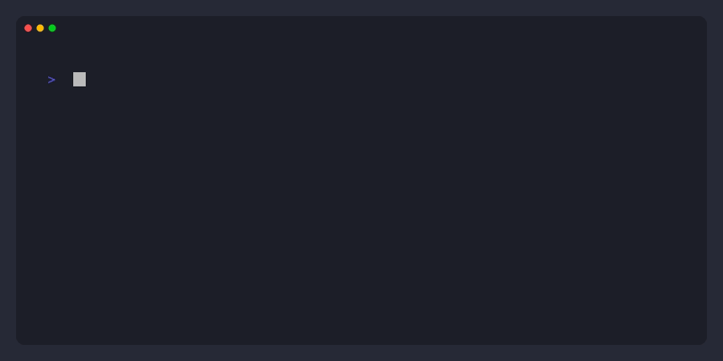

<div align="center">
  
  
  <br>
  
  <a href="https://git.io/typing-svg">
    
  </a>
  
  <br>
  
  
  
  
  
</div>

<br>



## 🌐 Universal Cross-Platform Architecture

**Engram Alpha MCP** is engineered to run seamlessly across **any operating system** (Linux, Windows, macOS, Docker containers, and edge devices) with zero required external dependencies:

```
┌────────────────────────────────────────────────────────────────────────┐
│                   UNIVERSAL MULTI-TIER HARDWARE ENGINE                 │
│                                                                        │
│  [ Tier 1: macOS / Apple Silicon ] ──► Direct AMX Accelerate BLAS      │
│  [ Tier 2: Linux / Windows ]       ──► OpenBLAS / MKL / NumPy Engine   │
│  [ Tier 3: Pure Stdlib Fallback ]  ──► 100% Zero-Dependency Python     │
└────────────────────────────────────────────────────────────────────────┘
```

---

## ⚡ Core Capabilities

1. **4-Way Reciprocal Rank Fusion (RRF):**
   Fuses Dense Semantic Vectors, Trigram FTS5 BM25 Lexical search, 2-Hop Knowledge Graph Spreading Activation, and ACT-R Power-Law Decay:
   $$\text{RRF\_Score}(d) = \left( \frac{1.2}{60 + \text{Rank}_{\text{dense}}} + \frac{1.0}{60 + \text{Rank}_{\text{lex}}} + \text{GraphActivation} \right) \times \left(1.0 + 0.1 \cdot \text{DaysOld}\right)^{-0.5}$$

2. **Embedded Autonomous Memory Agents:**
   - **Fact & Triples Extractor:** Automatically extracts atomic facts and `(Subject, Relation, Object)` knowledge graph triples.
   - **Contradiction & Reconciler:** Detects overlapping or contradicting facts to prevent agent amnesia.
   - **Episodic Reflection:** Synthesizes low-level logs and tasks into durable high-level insights.
   - **2-Hop Knowledge Graph Traversal:** Explores adjacent entity relationships with configurable spreading activation depth.

3. **Universal Storage Liveness Circuit Breakers:**
   Cross-platform thread-based `os.stat` probes check storage health with a 1-second timeout, preventing orchestrator deadlocks if remote, external, or cloud drives disconnect.

4. **Native Obsidian Vault Ingestion:**
   CLI command `engram ingest-obsidian <vault>` parses entire markdown vaults, automatically extracting `[[wikilinks]]` and `#tags` into Knowledge Graph triples alongside 150-word semantic chunk vectors.

---

## 🛠️ Quickstart

```bash
# 1. Install (Any OS)
pip install engram[local]

# 2. Ingest Obsidian Knowledge Vault
engram ingest-obsidian ~/Documents/MyObsidianVault

# 3. Autonomous Fact & Graph Extraction
engram extract "RayDaemon connects_to EngramAlpha for memory recall."

# 4. Hybrid Search with RRF + ACT-R Decay
engram search "Engram Alpha memory recall"

# 5. Query 2-Hop Knowledge Graph
engram query-graph "RayDaemon" --depth 2

# 6. Synthesize Episodic Reflections
engram reflect "Architecture"

# 7. Setup Claude Desktop (macOS, Windows, or Linux)
engram setup
```
